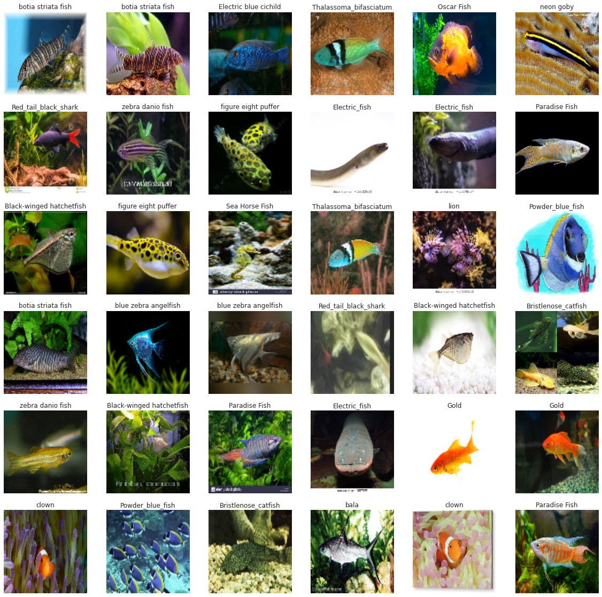
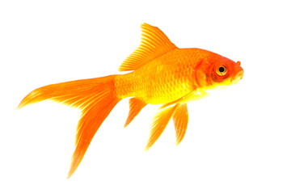

# Simple Fish Classification

In the name of God

This repository contains implementation of `Simple Fish Classification`.



## Install Requirements

To install requirements run the following command:

```shell
$ pip install -r requirements.txt
```

## Training

To train the model run the following command:

```shell
$ python3 train.py
```

Output:

```shell
Reading Dataset...
Found 4516 images belonging to 30 classes.
Found 488 images belonging to 30 classes.
Found 3040 images belonging to 30 classes.

Building Model...

Model: "sequential"
_________________________________________________________________
Layer (type)                 Output Shape              Param #   
=================================================================
conv2d (Conv2D)              (None, 54, 54, 96)        34944     
_________________________________________________________________
batch_normalization (BatchNo (None, 54, 54, 96)        384       
_________________________________________________________________
max_pooling2d (MaxPooling2D) (None, 26, 26, 96)        0         
_________________________________________________________________
conv2d_1 (Conv2D)            (None, 26, 26, 256)       614656    
_________________________________________________________________
batch_normalization_1 (Batch (None, 26, 26, 256)       1024      
_________________________________________________________________
max_pooling2d_1 (MaxPooling2 (None, 12, 12, 256)       0         
_________________________________________________________________
conv2d_2 (Conv2D)            (None, 12, 12, 384)       885120    
_________________________________________________________________
conv2d_3 (Conv2D)            (None, 12, 12, 384)       1327488   
_________________________________________________________________
conv2d_4 (Conv2D)            (None, 12, 12, 256)       884992    
_________________________________________________________________
max_pooling2d_2 (MaxPooling2 (None, 5, 5, 256)         0         
_________________________________________________________________
flatten (Flatten)            (None, 6400)              0         
_________________________________________________________________
dense (Dense)                (None, 4096)              26218496  
_________________________________________________________________
dropout (Dropout)            (None, 4096)              0         
_________________________________________________________________
dense_1 (Dense)              (None, 4096)              16781312  
_________________________________________________________________
dropout_1 (Dropout)          (None, 4096)              0         
_________________________________________________________________
dense_2 (Dense)              (None, 30)                122910    
=================================================================
Total params: 46,871,326
Trainable params: 46,870,622
Non-trainable params: 704
_________________________________________________________________

Training...
Epoch 1/100
142/142 [==============================] - 23s 151ms/step - loss: 4.2017 - categorical_accuracy: 0.0351 - val_loss: 3.2447 - val_categorical_accuracy: 0.0861
Epoch 2/100
142/142 [==============================] - 21s 149ms/step - loss: 3.1782 - categorical_accuracy: 0.1065 - val_loss: 2.7572 - val_categorical_accuracy: 0.1660
Epoch 3/100
142/142 [==============================] - 21s 150ms/step - loss: 2.8229 - categorical_accuracy: 0.1693 - val_loss: 2.4470 - val_categorical_accuracy: 0.2582
Epoch 4/100
142/142 [==============================] - 21s 149ms/step - loss: 2.5298 - categorical_accuracy: 0.2641 - val_loss: 2.6050 - val_categorical_accuracy: 0.2336
Epoch 5/100
142/142 [==============================] - 21s 149ms/step - loss: 2.4260 - categorical_accuracy: 0.2820 - val_loss: 2.1825 - val_categorical_accuracy: 0.3217
Epoch 6/100
142/142 [==============================] - 21s 149ms/step - loss: 2.1832 - categorical_accuracy: 0.3448 - val_loss: 1.9746 - val_categorical_accuracy: 0.3955
Epoch 7/100
142/142 [==============================] - 21s 149ms/step - loss: 1.9981 - categorical_accuracy: 0.4008 - val_loss: 1.9451 - val_categorical_accuracy: 0.4180
Epoch 8/100
142/142 [==============================] - 21s 149ms/step - loss: 1.8939 - categorical_accuracy: 0.4325 - val_loss: 1.7076 - val_categorical_accuracy: 0.4775
Epoch 9/100
142/142 [==============================] - 21s 149ms/step - loss: 1.7176 - categorical_accuracy: 0.4882 - val_loss: 1.5508 - val_categorical_accuracy: 0.5328
Epoch 10/100
142/142 [==============================] - 21s 150ms/step - loss: 1.5934 - categorical_accuracy: 0.5234 - val_loss: 1.3783 - val_categorical_accuracy: 0.5922
...
Epoch 50/100
142/142 [==============================] - 21s 147ms/step - loss: 0.1291 - categorical_accuracy: 0.9584 - val_loss: 0.8211 - val_categorical_accuracy: 0.8135
...
Epoch 95/100
142/142 [==============================] - 21s 148ms/step - loss: 0.0168 - categorical_accuracy: 0.9979 - val_loss: 0.8700 - val_categorical_accuracy: 0.8381
Epoch 96/100
142/142 [==============================] - 21s 146ms/step - loss: 0.0172 - categorical_accuracy: 0.9978 - val_loss: 0.9005 - val_categorical_accuracy: 0.8258
Epoch 97/100
142/142 [==============================] - 21s 146ms/step - loss: 0.0202 - categorical_accuracy: 0.9955 - val_loss: 0.8830 - val_categorical_accuracy: 0.8299
Epoch 98/100
142/142 [==============================] - 21s 148ms/step - loss: 0.0180 - categorical_accuracy: 0.9959 - val_loss: 0.9417 - val_categorical_accuracy: 0.8258
Epoch 99/100
142/142 [==============================] - 21s 148ms/step - loss: 0.0200 - categorical_accuracy: 0.9945 - val_loss: 0.9080 - val_categorical_accuracy: 0.8217
Epoch 100/100
142/142 [==============================] - 21s 148ms/step - loss: 0.0184 - categorical_accuracy: 0.9963 - val_loss: 0.9156 - val_categorical_accuracy: 0.8135

Evaluating...
{'loss': 1.4345703125, 'categorical_accuracy': 0.7154605388641357}

Saving Model...

Training Done
```

## Predicting

To predict the model run the following command:

```shell
$ python3 predict.py <image-file-name>
```

for example:

```shell
$ python3 predict.py image.jpg
```

Output:



```shell
Loading Model...
Reading Image...
Predicting...
Class: gold, Score: 1.0
```


## Links

* AlexNet: https://papers.nips.cc/paper/4824-imagenet-classification-with-deep-convolutional-neural-networks.pdf
* Dataset: https://www.kaggle.com/khaledelsayedibrahim/fishclassifierfinal
